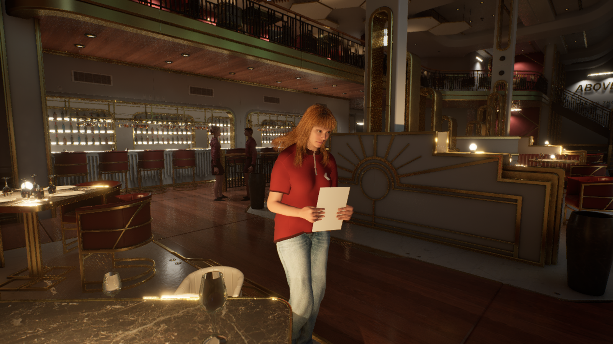
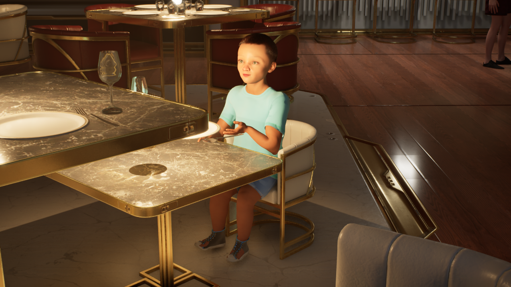
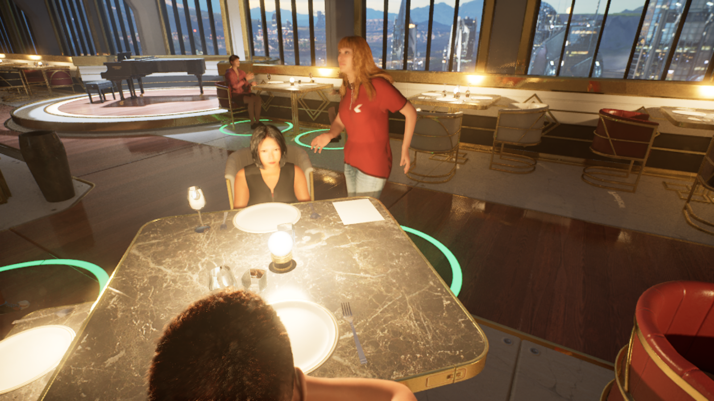

# AINPC: Author-Constrained Improvisation

[中文](README.zh-CN.md) · [Project page](https://ruixiaozhang.com/index_EN#work-ainpc)

AINPC studies how game characters can improvise while their actions remain accountable to the author of the world. A language model proposes what to say and do; author constraints check whether the proposal fits; Unreal Engine carries out the action and confirms its outcome.

Public overview updated **17 September 2026**. AINPC is a research prototype. This repository presents selected work, not a runnable software release or a complete research artifact.

## The research question

An action can be possible in the engine and still be wrong for the situation. A character might use a free object while ignoring a commitment or the intended order of events. The question is how an author can set boundaries for improvisation and inspect what happens when a proposal reaches them.

Saying “I'm seated” also cannot stand in for sitting down. The world must confirm the outcome before the next decision treats it as completed.

## Why a restaurant

A restaurant brings conversation, shared objects and social expectations into the same space. Seating, menus and table service make a character's choices visible: which person or object it approaches, what it handles, and when it acts. This gives the prototype a concrete setting for exploring the relationship between authored intentions and physical action.

## My contribution

I am responsible for the research framework, interaction design, UE prototype integration and development verification. My work connects model proposals with author-defined boundaries and embodied tasks, then examines the resulting behavior in the scene.

The prototype uses Unreal Engine, MetaHuman, Azure AI Speech and a hosted language model alongside third-party character, animation and environment assets. My contribution is the research and interaction system built with these tools; the underlying third-party assets retain their own rights.

## Current progress and limits

Partial paths exist for dialogue, captions and speech, movement, seating, object interaction and service tasks. Recent work focuses on how bodies and objects meet: a menu-grip pose candidate, a seating adaptation for a child character, and a controlled development test with a menu on the table. These are different stages of development, identified beside each image below.

The menu grip is an editor pose candidate, and the child pose does not establish a complete seating action. The menu-on-table image comes from a controlled run with a test setup, not an autonomous service sequence. Connecting the partial capabilities into sustained interaction remains unfinished; ordering through payment is incomplete.

Development verification is part of building this prototype. Its effectiveness has not been independently established, and formal gameplay evaluation has not begun. Execution reliability, character understanding and player experience still need separate investigation. Evaluation materials, data and findings remain private.

## How the prototype is organized

The upper layer proposes dialogue, intent, a high-level action and a target reference at decision points. It does not control the body frame by frame. Between the layers, author constraints check the proposal against locally defined goals, objects, action order and priorities. The design allows acceptance, an intent-preserving adjustment and another check, a request for a new proposal, or an explicit refusal to act. Some paths remain in development.

The lower layer runs in UE. It rechecks live conditions, carries out native tasks and uses world state to confirm the outcome. An incomplete task rolls back or ends explicitly. The next decision reads the actual result. Proposals, checks and outcomes are also recorded separately for review; those records do not select actions.

[Open the full-size diagram](docs/media/public-interaction-overview.svg). This conceptual diagram shows responsibilities and information categories. Actual JSON fields, prompts, author rules and repair algorithms remain private.

## Inside the prototype

These nine images show selected development work from August and September 2026. Candidate poses, controlled tests and runtime stills have different evidential limits. Some retain debug rings and unfinished visuals; none establishes a complete service flow or synchronized speech.

### Menu-grip pose candidate

17 Sep 2026 · Editor pose candidate for holding a menu. This image does not demonstrate runtime grasping.

### Child seating adaptation

17 Sep 2026 · Child pose-adaptation candidate. It does not demonstrate a complete seating action.

### Menu on the table

15 Sep 2026 · Controlled development run with a test setup. The menu is visible on the table; this frame does not establish an autonomous service sequence.

### Waitress at the table

15 Sep 2026 · Runtime still showing the Waitress and a seated character in the same table setting.

### A view from the seat

15 Sep 2026 · Runtime still showing seated posture, orientation and surrounding space.

### A shared restaurant

August–September 2026 · Development still showing characters, tables and walkways.

### A seated conversation

August–September 2026 · Development still showing the spatial setting for conversation.

### Seated together

31 Aug 2026 · Runtime still showing the Partner character's seated pose and table position.

### Table gestures

8 Sep 2026 · Runtime still showing character poses during a table exchange.

[Prototype guide](docs/PROTOTYPE_GUIDE.md) · [Image inventory](docs/public-media.json) · [Version scope](docs/VERSION_SCOPE.md) · [Disclosure](DISCLOSURE.md) · [Rights and credits](RIGHTS_AND_CREDITS.md)
