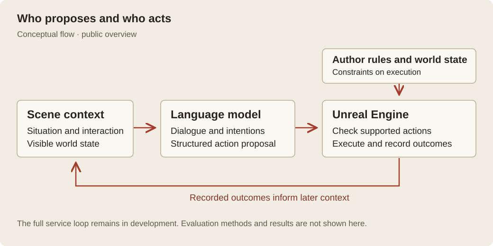

# AINPC: Author-Constrained Improvisation

[中文](README.zh-CN.md) · [Project page](https://ruixiaozhang.com/index_EN#work-ainpc)

AINPC studies how game characters can improvise while authors retain control of their worlds. Using a restaurant prototype in Unreal Engine, I explore how creators can preserve rules and context when language models contribute to character dialogue and action.

The restaurant prototype. These development stills show the setting and character relationships, not validation of complete tasks or synchronized speech.

## Why a restaurant

A restaurant makes this question tangible. Guests and service staff share space and objects, so one character's choice affects others. An action that the engine can execute may still ignore an earlier commitment or the intended order of service. The system therefore needs to consider both whether an action can happen and whether it fits the author-defined context.

## My work and approach

I develop the research framework, interaction design and UE prototype integration, connecting model proposals, local checks and character tasks alongside dialogue, captions and speech. The prototype uses MetaHuman and existing character, animation and environment assets.

The design separates responsibilities: the language model proposes dialogue and high-level actions, author constraints check whether they fit, and UE retains authority to execute and change world state. Subsequent decisions use actual execution outcomes. Proposals, checks and results are recorded separately for review. The diagram maps these responsibilities; some paths remain in development.

## Research focus and next steps

The research distinguishes conformity to an author's intent from successful execution. Examining them separately could help creators understand unexpected character responses and revise their designs. This potential benefit still needs evaluation, with separate evidence for execution reliability and player experience.

Dialogue, speech and some character interactions have working paths. The next step is to connect them into a sustained multi-character demonstration. A complete autonomous service flow is unfinished, and formal gameplay evaluation has not begun. This overview shares the research approach and prototype setting; operational scoring rules, prompts, algorithm implementations, evaluation data and findings remain private.

## Prototype scenes

Development captures from August–September 2026.

### A place for conversation

Conversation sits within a shared table setting, where character orientation, distance and nearby objects provide context for interaction.

### Characters in a shared situation

Guests and service staff inhabit the same environment. Their relationships provide a setting for examining authored intentions and action choices.

[Prototype guide](docs/PROTOTYPE_GUIDE.md) · [Method notes](docs/methods/README.md) · [Image inventory](docs/public-media.json) · [Version scope](docs/VERSION_SCOPE.md) · [Disclosure](DISCLOSURE.md) · [Rights and credits](RIGHTS_AND_CREDITS.md)

Public overview updated 17 September 2026. Method notes added 24 September 2026. The overview above mirrors the project website; dated method notes are linked separately. This is not a runnable project or a complete research artifact.
