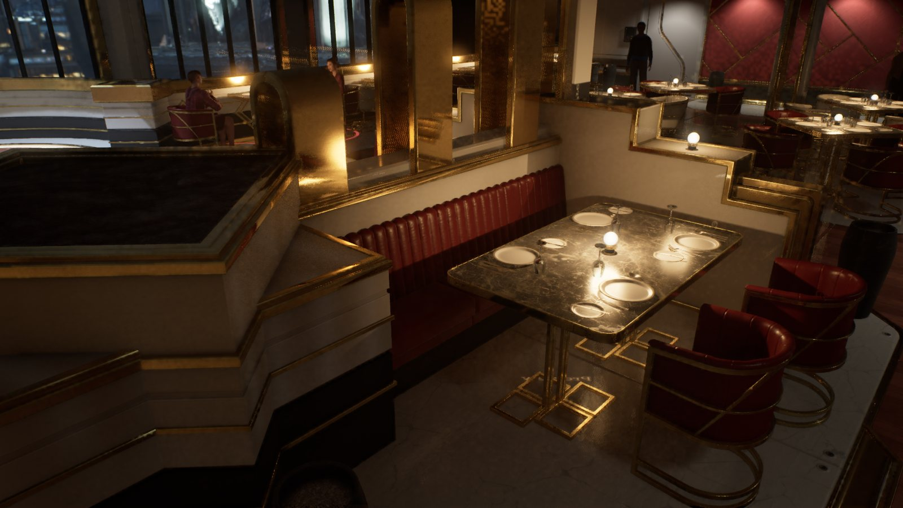
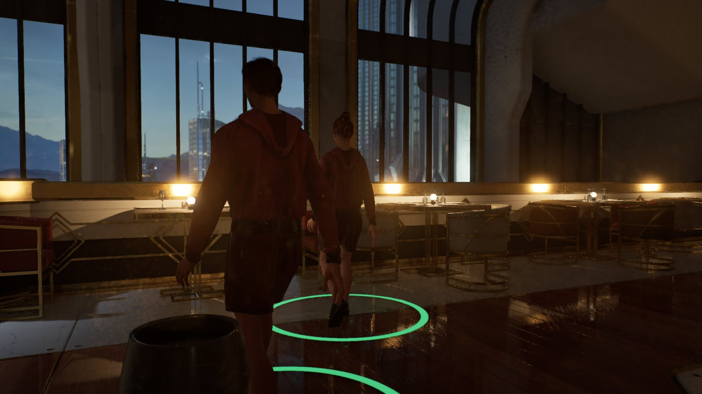
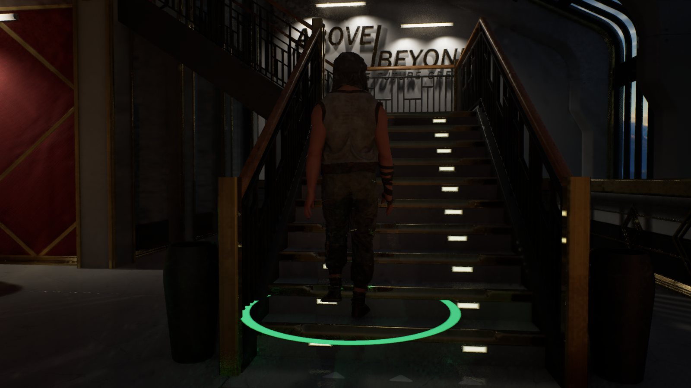
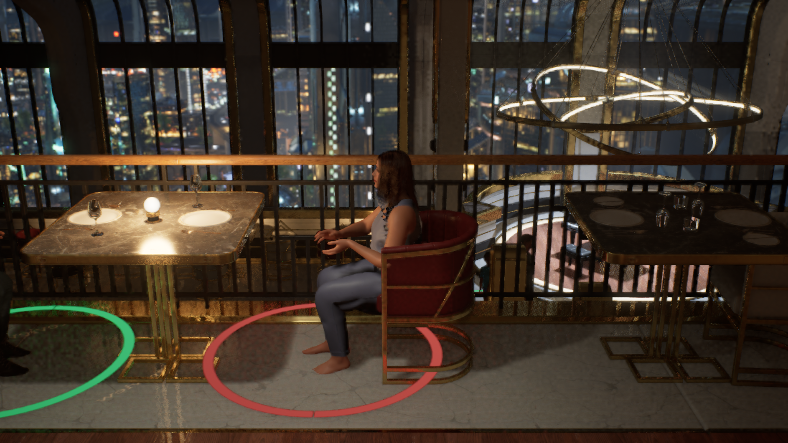
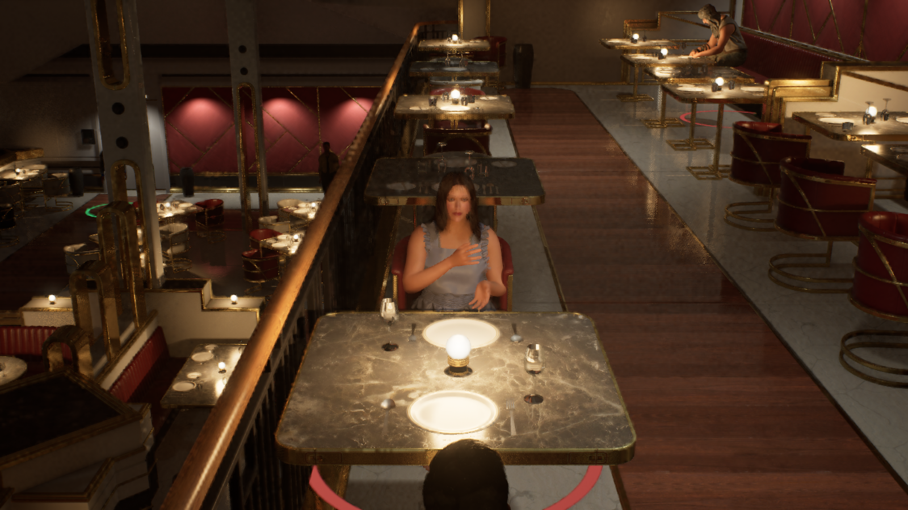
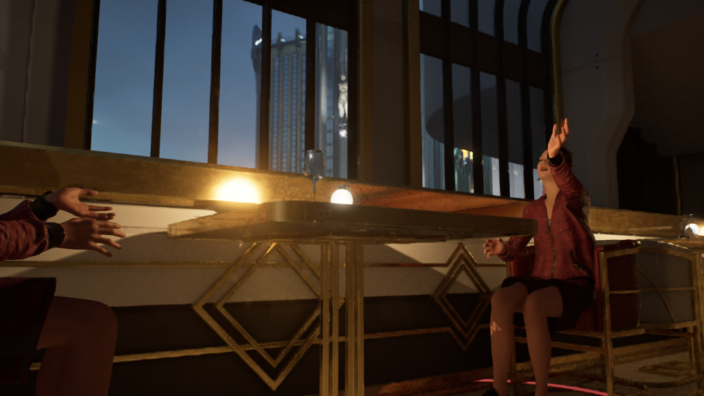
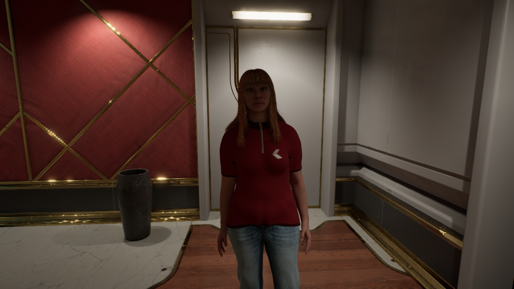

# AINPC: Author-constrained character interaction

[中文](README.zh-CN.md)

This overview introduces the research prototype and its current progress. It is not a runnable software release or a complete research artifact.

[Project page](https://ruixiaozhang.com/index_EN#work-ainpc)

How can a game character improvise without taking control away from the person who authored its world?

## Where the question began

I use a restaurant prototype to make this question concrete. A character might give a convincing answer yet try to use an occupied seat or ignore an earlier commitment. Using that seat may break an explicit rule. Ignoring a commitment may be allowed by the system but still conflict with the author's judgment of the situation. I therefore examine whether an action is permitted separately from whether it fits the author's intention.

## From dialogue to action

To preserve that distinction, I let the language model propose dialogue, intentions and high-level actions as structured data. Unreal Engine controls movement, interaction and changes to the world. The model's proposal can then be examined separately from the action the engine actually performs.

In the implemented paths, local checks assess a proposal against author-defined constraints and the current scene state. They check whether the target exists, the resource is available and the interaction is allowed before the proposal is handled. Rejection, fallback and execution outcomes are recorded for later inspection. These paths are still being extended, and the prototype does not guarantee a successful repair for every proposal.

Execution also needs its own tracking because a model response and a character animation do not finish at the same time. In the implemented paths, the runtime tracks each action from start to finish and records completion only after engine-side confirmation. Speech synthesis and captions present the dialogue; movement and seating have separate execution tasks. A character's claim to have finished cannot substitute for evidence in the world state.

## What the research examines

Separating proposals from execution raises a further question about evaluation: does an automated judgment reflect the distinctions an author makes in a particular situation? Answering this does not establish successful engine execution or an improvement in player experience. This page introduces the research question and prototype approach. Detailed evaluation rules, data and findings are not public.

## Current progress and next steps

The images below come from development in August and September 2026. They include runtime stills and a separately labelled static editor view, showing the restaurant, characters, seating and gestures rather than sustained reliable behavior. The full service sequence, from ordering to payment, remains in development. Formal evaluation during play is planned for later work.

The diagram explains the division of responsibility, not the complete implementation. The model proposes actions, and the engine checks and executes them. Evaluation formulas, private data and research findings are not shown.

## Inside the prototype

### A shared world

The restaurant brings characters, tables and shared spaces into one scene. It provides a concrete setting for investigating how dialogue relates to actions in a world with rules.

### Dialogue in a physical setting

Seating gives the conversation a visible spatial context. Different parts of the prototype handle speech, captions, posture and movement. The image shows the interaction setting; its quality still needs to be evaluated.

### Objects as interaction conditions

Seats and tables are objects the characters act on, so they cannot be treated only as scenery. The ongoing work will continue to check whether intentions map to valid targets and whether the expected changes can be observed and confirmed after execution.

## Further views of the same prototype

## Characters and table interactions: additional views

### The Partner table

Runtime still, 31 August 2026. The Partner character’s seated pose and the furniture establish the spatial setting for an exchange. This historical development image does not verify seating for every character in the current build.

### Across the table

Runtime still, 31 August 2026. Another view shows the character’s orientation, gesture and position relative to others at the table. It shows an interaction setting; speech content and turn-taking quality require a continuous record.

### Gestures in a shared scene

Runtime still, 8 September 2026. Gestures give the exchange a visible bodily form. The frame records a momentary pose, not evidence of correct dialogue, synchronized speech or a completed service task.

### The service character

Static editor view, 12 September 2026. The service character was identified against the project’s actor data. This close view shows the character and restaurant environment, rather than a service-sequence or speech test.

[Disclosure scope](DISCLOSURE.md) · [Rights and credits](RIGHTS_AND_CREDITS.md)
