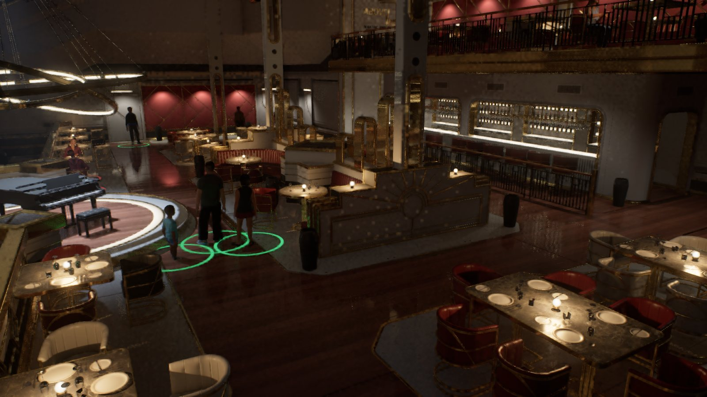
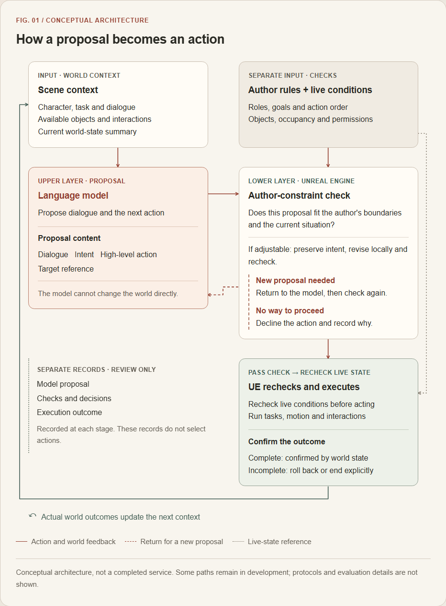
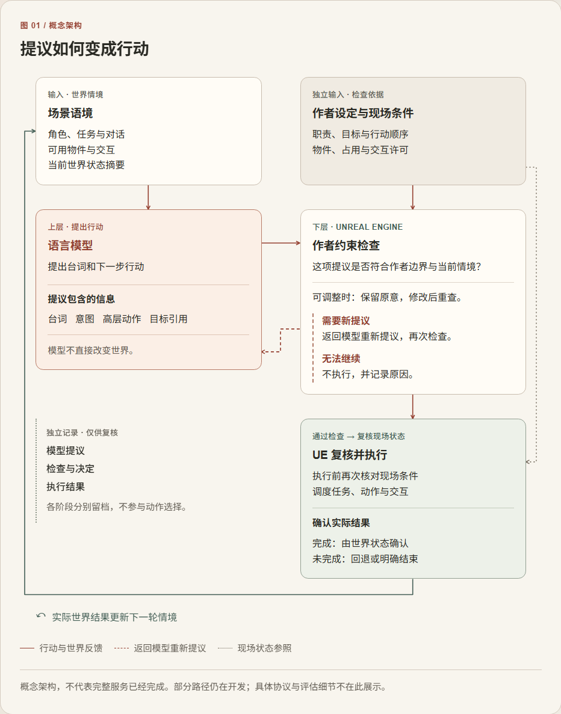
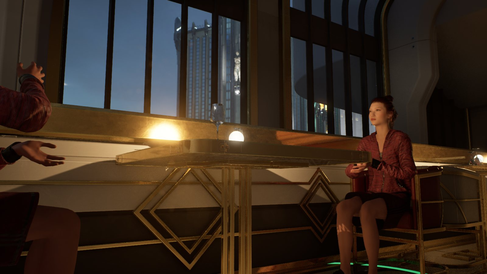
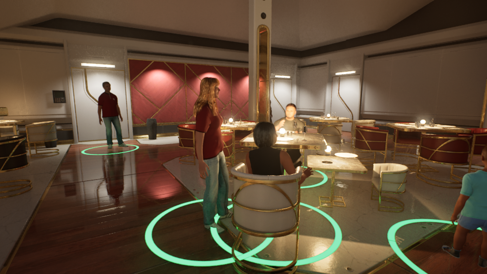

# AINPC: Author-Constrained Improvisation / AINPC: 作者约束的即兴行动

**English**

[Project page](https://ruixiaozhang.com/index_EN#work-ainpc)

AINPC studies how game characters can improvise while authors retain control of their worlds. Using a restaurant prototype in Unreal Engine, I explore how creators can preserve rules and context when language models contribute to character dialogue and action.

The restaurant prototype. These development stills show the setting and character relationships, not validation of complete tasks or synchronized speech.

**中文**

[项目网页](https://ruixiaozhang.com/#work-ainpc)

AINPC 研究游戏角色的即兴回应与作者控制如何共存。我以 Unreal Engine 中的餐厅为原型场景，探索语言模型参与角色对话和行动后，创作者如何继续掌握世界的规则与情境。

餐厅原型总览。以下开发静帧呈现场景与角色关系，不作为完整任务或语音同步的验证。

## Why a restaurant / 为什么选择餐厅

**English**

A restaurant makes this question tangible. Guests and service staff share space and objects, so one character's choice affects others. An action that the engine can execute may still ignore an earlier commitment or the intended order of service. The system therefore needs to consider both whether an action can happen and whether it fits the author-defined context.

**中文**

餐厅把这个问题放进了日常可理解的关系中：顾客与服务人员共享空间和物件，一个角色的选择会影响其他人。即使动作在引擎中可以执行，也可能忽略先前的承诺或应有的服务顺序。因此，系统既要处理行动能否发生，也要考虑它是否符合作者设定的情境。

## My work and approach / 我的工作与方案

**English**

I develop the research framework, interaction design and UE prototype integration, connecting model proposals, local checks and character tasks alongside dialogue, captions and speech. The prototype uses MetaHuman and existing character, animation and environment assets.

The design separates responsibilities: the language model proposes dialogue and high-level actions, author constraints check whether they fit, and UE retains authority to execute and change world state. Subsequent decisions use actual execution outcomes. Proposals, checks and results are recorded separately for review. The diagram maps these responsibilities; some paths remain in development.

Conceptual architecture, not a completed service. Some paths remain in development; protocols and evaluation details are not shown.

**中文**

我负责研究框架、交互设计和 UE 原型集成，将模型提议、本地检查与角色任务连接起来，并集成对话、字幕和语音。原型使用 MetaHuman，以及既有的角色、动画和环境资产。

方案采用分层分工：语言模型根据情境提出台词和高层行动，作者约束检查提议是否合适，UE 保留执行和改变世界状态的权限。后续决策以实际执行结果为依据。提议、检查与结果另行记录，供事后复核；下图展示这些职责关系，部分路径仍在开发。

概念架构，不代表完整服务已经完成。部分路径仍在开发；具体协议与评估细节不在此展示。

## Motion, hands and shared objects / 动作、手部与共享物件

**English**

The execution work also considers three levels: situation and presentation, whole-body motion, and hand states. These describe how an action is expressed; they do not replace the author-constraint checks. A learned situation-to-presentation mapping remains future work. The current body-motion representation uses a linear projection, while learned alternatives remain under comparison. Hand states are working descriptions, not validated grasp categories.

Current development also addresses sharing objects and taking a seat when several guests are present. These are development rules, not a completed autonomous service. The [dated method notes](https://github.com/Shawn200212/Author-Constrained-AINPC/tree/main/docs/methods) describe their purpose and limits without publishing implementation details.

**中文**

在执行侧，我还探索三个层次的表征：情境与表现、全身动作、手部状态。它们处理行动如何呈现，不取代作者约束检查。情境到表现的学习映射仍是后续工作；当前身体动作表征使用线性投影，学习模型仍在比较中。手部状态是开发中的描述，不是经过验证的抓握分类。

近期开发还关注多位顾客在场时如何共用物件、接近桌边并入座。这些是正在完善的执行规则，不代表完整自主服务已经完成。[按日期整理的方法说明](https://github.com/Shawn200212/Author-Constrained-AINPC/tree/main/docs/methods)介绍了这些工作的目的和限制，不公开具体实现。

## Research focus and limits / 研究关注与当前限制

**English**

The research distinguishes conformity to an author's intent from successful execution. Examining them separately could help creators understand unexpected character responses and revise their designs. This potential benefit still needs evaluation, with separate evidence for execution reliability and player experience.

Dialogue, speech and some character interactions have working paths. The next step is to connect them into a sustained multi-character demonstration. A complete autonomous service flow is unfinished, and formal gameplay evaluation has not begun. This overview shares the research approach and prototype setting; operational scoring rules, prompts, algorithm implementations, evaluation data and findings remain private.

**中文**

研究的重点是区分“符合作者意图”与“实际执行成功”。把两者分别检查，有望帮助创作者理解角色的意外回应来自哪里，并据此调整设计。这一潜在价值仍需验证，执行可靠性与玩家体验也需要各自的证据。

目前，对话、语音和部分角色交互已有运行路径，下一步是将它们连接成持续的多角色演示。完整自主服务链尚未完成，正式游玩评估尚未开展。这里公开研究思路与原型场景；具体评分规则、提示词、算法实现、评估数据和研究结果暂不公开。

## Prototype scenes / 原型场景

**English**

### A place for conversation

Conversation sits within a shared table setting, where character orientation, distance and nearby objects provide context for interaction.

### Characters in a shared situation

Guests and service staff inhabit the same environment. Their relationships provide a setting for examining authored intentions and action choices.

**中文**

### 对话发生的空间

对话被放在具体的餐桌情境中，角色的朝向、距离与周围对象共同构成互动背景。

### 共享情境中的多角色

顾客与服务人员处于同一环境，角色之间的关系为研究作者意图与行动选择提供语境。

## Related pages / 相关页面

**English**

[Dated method notes](docs/methods/README.md) · [Prototype guide](docs/PROTOTYPE_GUIDE.md) · [Version scope](docs/VERSION_SCOPE.md)

[AIWG](https://github.com/Shawn200212/AI-World-Generator)

[Disclosure](DISCLOSURE.md) · [Image inventory](docs/public-media.json) · [Rights and credits](RIGHTS_AND_CREDITS.md)

Overview updated 26 September 2026. The narrative, conceptual figure and scene images mirror the project website. This repository is a research overview, not a runnable project or a complete research artifact.

**中文**

[按日期整理的方法说明](docs/methods/README.md) · [原型导览](docs/PROTOTYPE_GUIDE.md) · [版本范围](docs/VERSION_SCOPE.md)

[AIWG](https://github.com/Shawn200212/AI-World-Generator)

[公开范围](DISCLOSURE.md) · [图片清单](docs/public-media.json) · [权利与署名](RIGHTS_AND_CREDITS.md)

概览更新于 2026 年 9 月 26 日。正文、概念图和场景图与项目网页保持一致。本仓用于研究介绍，不是可运行工程或完整研究材料。
