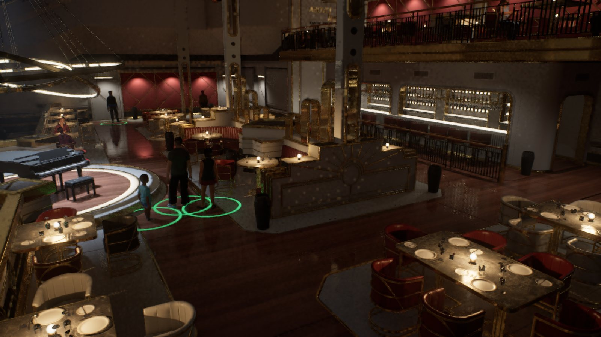
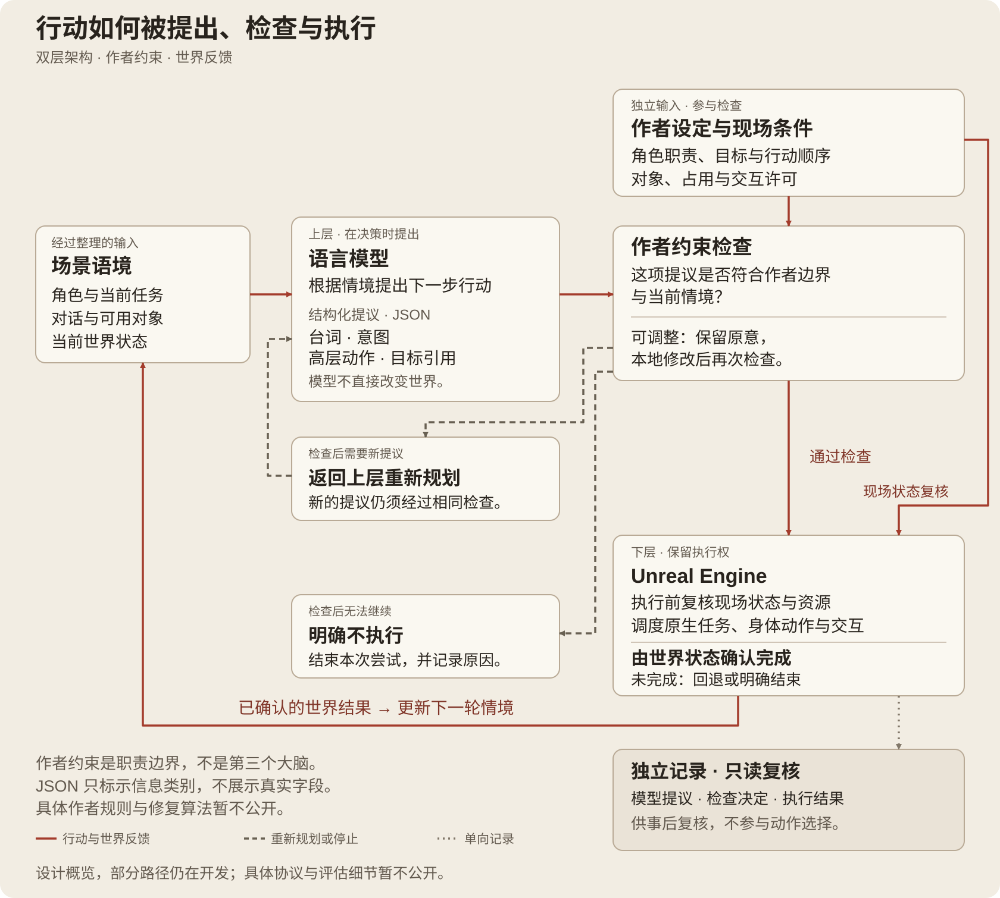
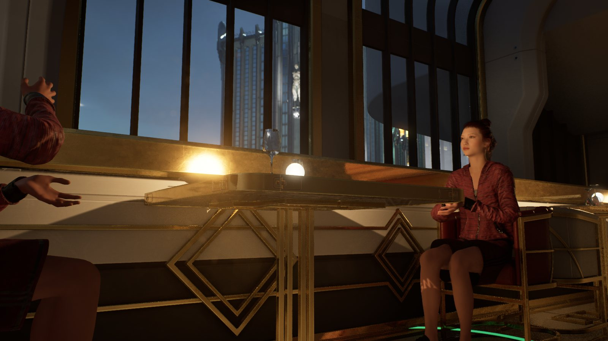
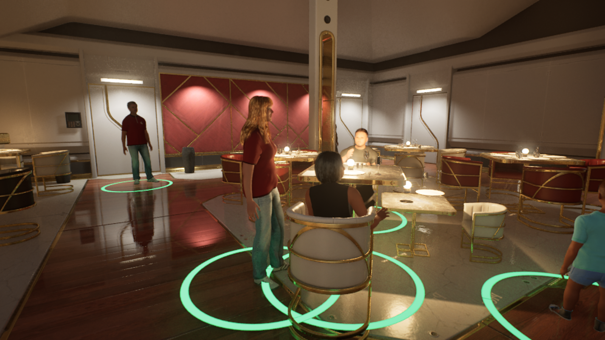

# AINPC：作者约束的即兴行动

[English](README.md) · [项目网页](https://ruixiaozhang.com/#work-ainpc)

AINPC 研究游戏角色的即兴回应与作者控制如何共存。我以 Unreal Engine 中的餐厅为原型场景，探索语言模型参与角色对话和行动后，创作者如何继续掌握世界的规则与情境。

餐厅原型总览。以下开发静帧呈现场景与角色关系，不作为完整任务或语音同步的验证。

## 为什么选择餐厅

餐厅把这个问题放进了日常可理解的关系中：顾客与服务人员共享空间和物件，一个角色的选择会影响其他人。即使动作在引擎中可以执行，也可能忽略先前的承诺或应有的服务顺序。因此，系统既要处理行动能否发生，也要考虑它是否符合作者设定的情境。

## 我的工作与方案

我负责研究框架、交互设计和 UE 原型集成，将模型提议、本地检查与角色任务连接起来，并集成对话、字幕和语音。原型使用 MetaHuman，以及既有的角色、动画和环境资产。

方案采用分层分工：语言模型根据情境提出台词和高层行动，作者约束检查提议是否合适，UE 保留执行和改变世界状态的权限。后续决策以实际执行结果为依据。提议、检查与结果另行记录，供事后复核；下图展示这些职责关系，部分路径仍在开发。

## 研究关注与下一步

研究的重点是区分“符合作者意图”与“实际执行成功”。把两者分别检查，有望帮助创作者理解角色的意外回应来自哪里，并据此调整设计。这一潜在价值仍需验证，执行可靠性与玩家体验也需要各自的证据。

目前，对话、语音和部分角色交互已有运行路径，下一步是将它们连接成持续的多角色演示。完整自主服务链尚未完成，正式游玩评估尚未开展。这里公开研究思路与原型场景；具体评分规则、提示词、算法实现、评估数据和研究结果暂不公开。

## 原型场景

2026 年 8—9 月开发画面。

### 对话发生的空间

对话被放在具体的餐桌情境中，角色的朝向、距离与周围对象共同构成互动背景。

### 共享情境中的多角色

顾客与服务人员处于同一环境，角色之间的关系为研究作者意图与行动选择提供语境。

[原型导览](docs/PROTOTYPE_GUIDE.md) · [图片清单](docs/public-media.json) · [版本范围](docs/VERSION_SCOPE.md) · [公开范围](DISCLOSURE.md) · [权利与署名](RIGHTS_AND_CREDITS.md)

公开概览更新于 2026 年 9 月 17 日。本仓与项目网页保持同一展示范围，不提供可运行工程或完整研究材料。
